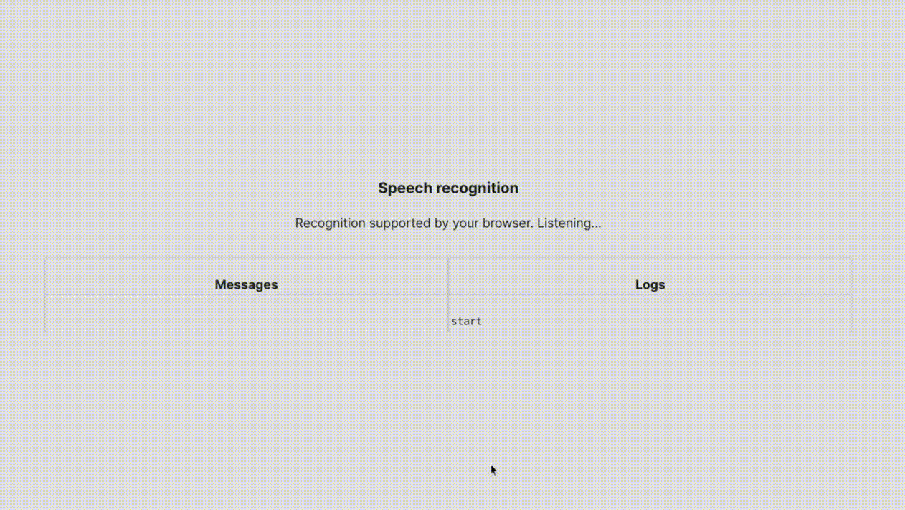

# Browser speech recognition

Small react application demonstrates how to use browser speech recognition API.




### Running

```
npm install
npm start
```

### TODO

- Intelligent concatenation of recognized words
- Safe threshold before sending recognized words to the server